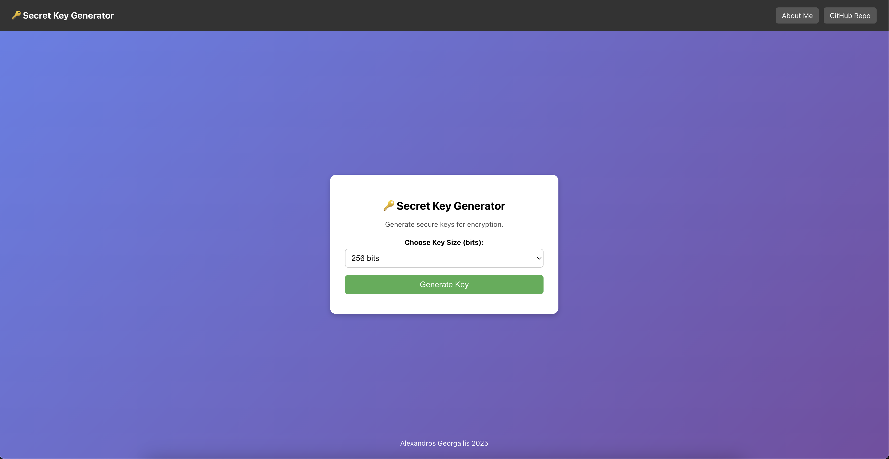
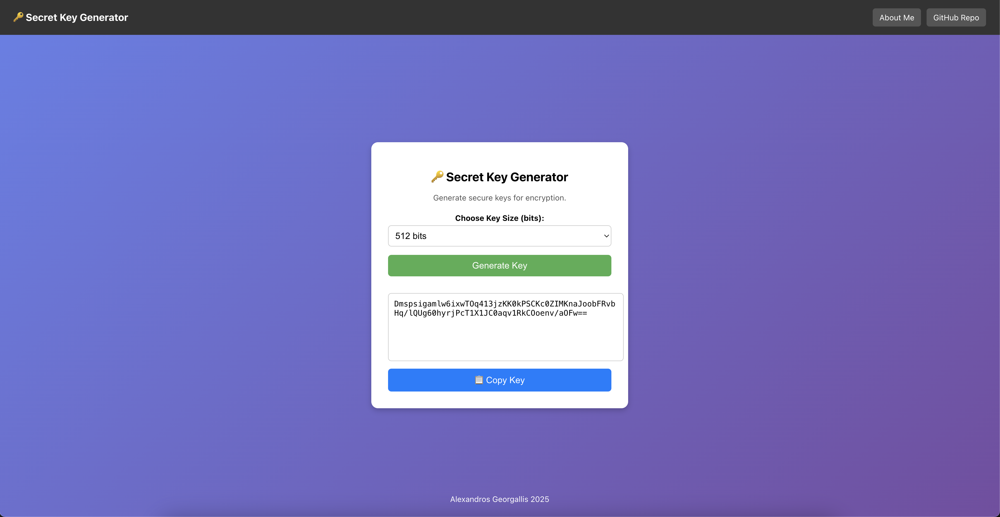

# 🔑 Secret Key Generator

🚀 **LIVE NOW:** [Secret Key Generator]([https://your-app.onrender.com](https://secret-key-generator.onrender.com/))

A very easy to use Secret Key Generator built with **Spring boot & React**.
Users can generate **random secret keys** of different bits (64, 128, 256,...,4096)
and copy them to the clipboard instantly. 

---

## **Screenshots**
### **User Interface**

### **Key Generation**

---

## **Features** 
- Select **key size** (64, 128, 256, 512, 1024, 2048, 4096 bits)
- Generate **random** keys
- **Copy keys** to clipboard

---

## **Tech Stack**
- **Frontend**: Rect, Axios
- **Backend**: Spring Boot (Java 17++)
- **API** RESTful service with SecureRandom
- **UI**: CSS

